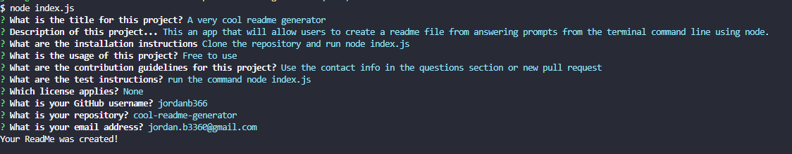
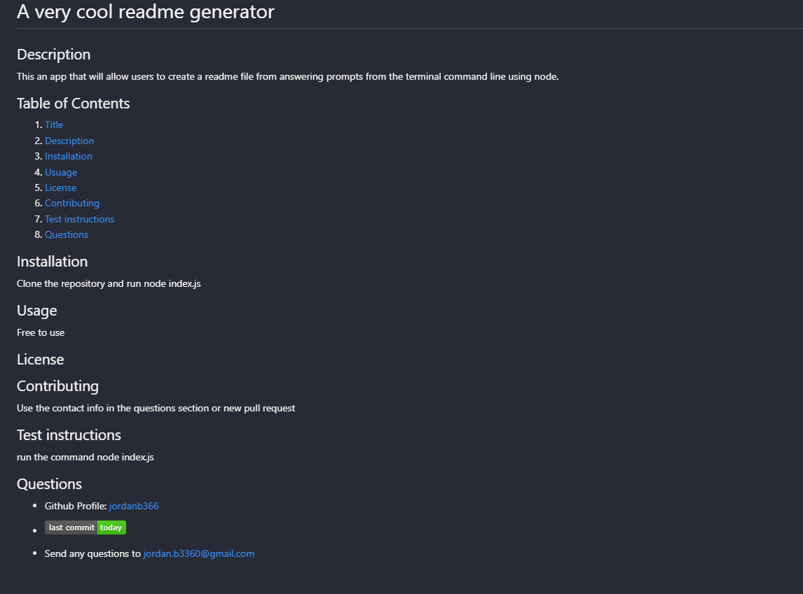

# cool-readme-generator

CLI ReadME generator

## Description

Using node.js and inquirer, this app allows users to generate a very cool readme from answering the prompts once run. The prompts include a series of questions such as title of project, description, installation instructions, usage, contriubtion, test instructions, licenses, Github username, respository name, and email address. To invoke the program the users uses the command node index.js. Once the user has answered the prompts the generated read me file will be accessible.

## Link to demonstration of app

[Link to demo of app](https://drive.google.com/file/d/1NQ3hGluS-ZkpZ5KKLSFqS0x3IOZcWG3m/view)

## Screenshot(s)

## Link to sample readme

[Link to sample readme](https://github.com/jordanb366/cool-readme-generator/blob/main/sample/sampleReadme.md)
